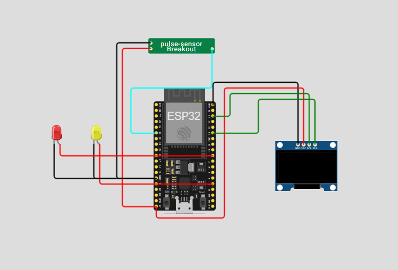

# 🫀 Monitor Cardíaco Inteligente com ESP32

Aprenda a monitorar sua **frequência cardíaca** em tempo real usando o **ESP32** e um sensor de pulso analógico. O sistema exibe o **ritmo atual no OLED 128x64**, aciona LEDs para alertas visuais e envia os dados para monitoramento remoto via **MQTT**.

---

## 🔹 O que este projeto faz

- Mede batimentos por minuto (BPM) através de um sensor de pulso.  
- Aciona **LED amarelo** se o ritmo estiver abaixo do normal e **LED vermelho** se estiver acima.  
- Mostra em tempo real os valores no **display OLED**.  
- Publica os dados via **MQTT**, permitindo que outros dispositivos ou aplicativos recebam essas informações.

---

## 🧰 Materiais Necessários

- ESP32 DevKit C V4  
- Sensor de batimentos cardíacos (pino analógico 35)  
- Display OLED 128x64 (I2C)  
- LED amarelo e vermelho para alertas visuais  
- Acesso à rede Wi-Fi  
- Broker MQTT (ex: test.mosquitto.org)

---

## ⚙️ Como usar

1. Monte o circuito conforme o diagrama do protótipo.  
2. Configure as credenciais Wi-Fi e o broker MQTT no código.  
3. Faça o upload do sketch para o ESP32.  
4. Abra o monitor serial para verificar a leitura de BPM e o status do sistema.  
5. Observe o OLED e os LEDs reagirem conforme a frequência cardíaca.

---

## ✅ Testes e Resultados

- Simulações de diferentes sinais analógicos confirmaram a precisão das leituras de BPM.  
- LEDs acionam corretamente conforme o batimento detectado.  
- O display OLED mostra os valores e o estado do ritmo de forma clara e imediata.  
- Publicações via MQTT foram recebidas corretamente em ferramentas como **MQTT Explorer**, validando o monitoramento remoto.

---

## 💡 Possíveis melhorias

- Criar um histórico de BPM usando **Firebase** ou **SQLite**.  
- Desenvolver um dashboard web ou aplicativo mobile para visualização gráfica contínua.  
- Adicionar notificações push em smartphones caso o BPM ultrapasse limites.  
- Integrar múltiplos sensores para monitoramento de mais de uma pessoa simultaneamente.

---

## 📖 Referências

- Espressif Systems. *ESP32 Hardware Reference Manual*. [s.l.]: Espressif, 2023.  
- Adafruit. *Adafruit GFX & SSD1306 Library Documentation*. [s.l.]: Adafruit, 2024.  
- HiveMQ. *MQTT Essentials – A Lightweight IoT Protocol*. [s.l.]: HiveMQ, 2022.  
- Arduino Project Hub. *Monitorando Pulsos com ESP32*. [s.l.]: Arduino.cc, 2023.
